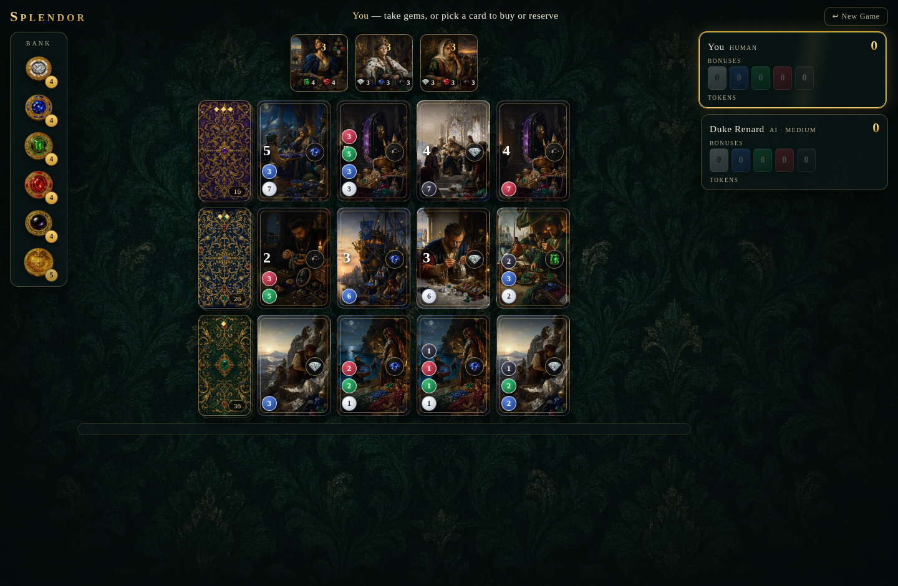
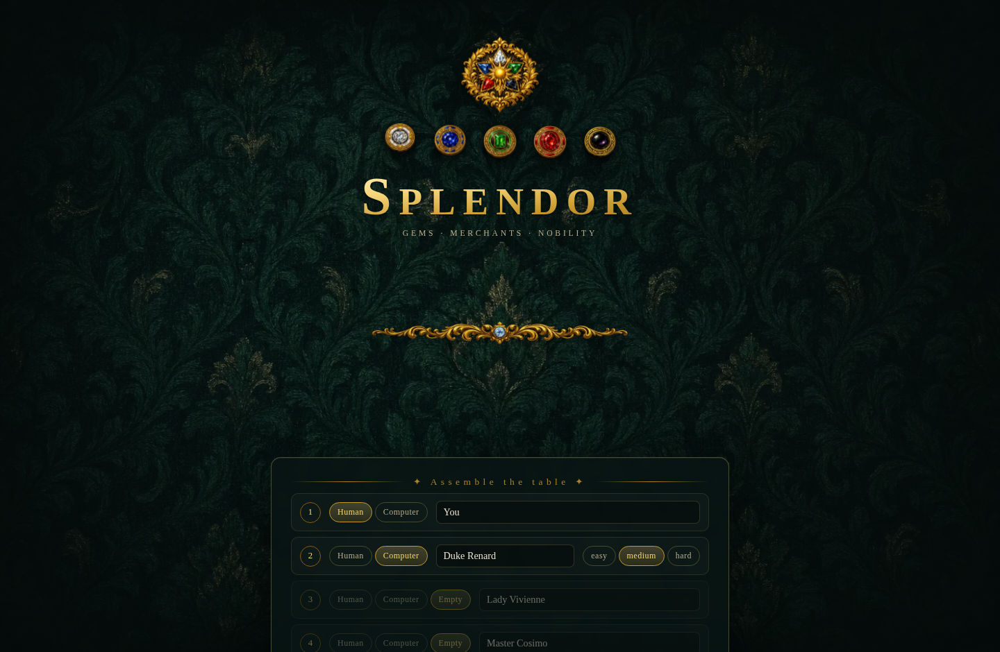
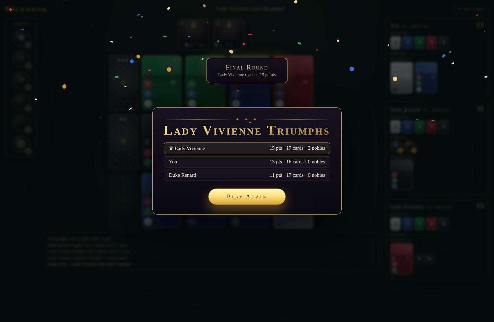

# Splendor

A faithful, fully playable implementation of the board game **Splendor** (Marc André) for the browser — with hand-crafted SVG gem artwork, a luxe gold-and-felt table aesthetic, and rich animations throughout.



## Features

- **Complete base game** — all 90 authentic development cards (40/30/20 per tier) and all 10 nobles, verified against two independent open-source datasets
- **2–4 players, hotseat multiplayer** — any mix of humans and computer opponents
- **Single player vs AI** — three difficulty levels (easy / medium / hard) driven by a heuristic engine that evaluates card value, noble progress, token efficiency, and (on hard) denies opponents' near-winning cards
- **Full rules enforcement** — take 3 different gems / 2 same (pile of 4+), reserving with gold jokers (max 3), bonus discounts, gold wildcards, the 10-token hand limit with discards, automatic noble visits with player choice on ties, final-round finish with equal turns, and the fewest-cards tie-breaker
- **Exquisite presentation** — AI-painted Renaissance artwork (cards, tokens, nobles, table cloth) with animated card deals, gems that fly from the bank to your tableau, noble-visit banners, a confetti victory ceremony, and a live game log
- **Fully responsive** — desktop, tablet, and phone-portrait layouts
- **Installable PWA** — offline-capable via a service worker; add it to your home screen from any hosted URL

| Menu | Victory |
| --- | --- |
|  |  |

## Running

```bash
npm install
npm run dev      # local dev server
npm run build    # produces a single self-contained dist/index.html
npm test         # engine test suite (rules + AI self-play)
```

The production build is a **single HTML file** (`dist/index.html`) with everything inlined — open it directly in any browser, no server needed. The build also emits `manifest.webmanifest`, `sw.js`, and icons alongside it, so hosting the `dist/` folder anywhere over HTTPS gives you an installable, offline-capable PWA.

## Hosting (Vercel)

Deploys to Vercel as a static Vite site (build `npm run build`, output `dist`). Access protection is **currently disabled** — Basic Auth breaks re-login in installed iOS PWAs. See [docs/HOSTING.md](docs/HOSTING.md) for how to re-enable it or use a PWA-friendly alternative.

## How to play

First to **15 prestige points** triggers the final round; everyone gets an equal number of turns, then the highest score wins (fewest cards breaks ties). On your turn, do one of:

1. **Take 3 gems** of different colors (click three bank piles, then *Take gems*)
2. **Take 2 gems** of one color (click the same pile twice — its pile must hold 4+)
3. **Reserve a card** (click a card → *Reserve*, or click a face-down deck for a blind reserve) — you gain a gold joker
4. **Buy a card** from the market or your reserve — your purchased cards give permanent gem discounts

Nobles visit automatically when your card bonuses meet their requirements — each is worth 3 points.

## Architecture

- `src/engine/` — pure TypeScript, framework-free game engine
  - `types.ts` — domain model, `cards.ts` — the verified card/noble dataset
  - `game.ts` — immutable state machine (action → discard → noble → next turn), validation, move generation
  - `ai.ts` — heuristic computer opponent with difficulty tiers
  - `game.test.ts` — 24 tests: dataset integrity, every rule, and full AI self-play games with token-conservation checks
- `src/ui/` — React components: menu, board, cards, nobles, player panels, and a Web-Animations-API "flying clone" layer for token/card motion
